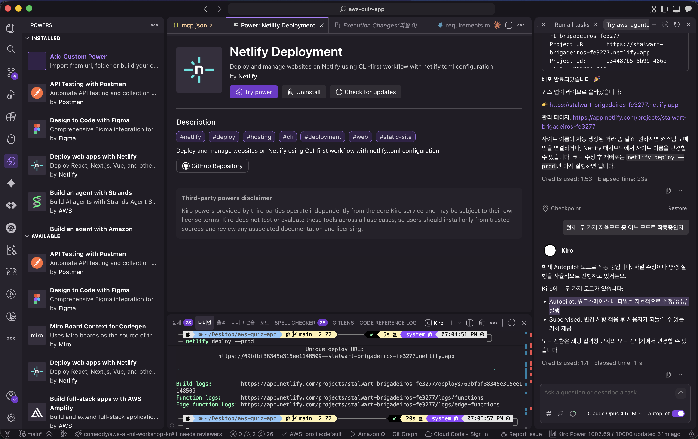

# Powers (파워)

> **원클릭 통합** 기능으로 외부 도구와 서비스를 Kiro에 확장합니다.

## 주요 특징

### 키워드 활성화

채팅에서 특정 주제를 언급하면 Kiro가 자동으로 관련 Power를 제안합니다. 예: "deploy"라고 말하면 Netlify를 제안합니다.

### 원클릭 설치

설정 파일도, 터미널 명령도 필요 없습니다. 카탈로그를 탐색하고, 설치 버튼을 클릭하면 끝입니다.

### 번들 패키지

각 Power는 문서, 워크플로우 가이드, 도구 서버를 하나의 패키지로 묶어 제공합니다.

## 런치 파트너

| 파트너 | 분야 |
|--------|------|
| Datadog | 모니터링 |
| Dynatrace | 관측성 |
| Figma | 디자인 |
| Neon | 서버리스 Postgres |
| Netlify | 배포 & 호스팅 |
| Postman | API 테스팅 |
| Supabase | 백엔드 서비스 |
| Stripe | 결제 |

> 이 외에도 AWS Aurora, Strands SDK 등 다양한 파트너가 있습니다.

> 자세한 내용은 [공식 문서](https://kiro.dev/docs/powers/)를 참고하세요.
