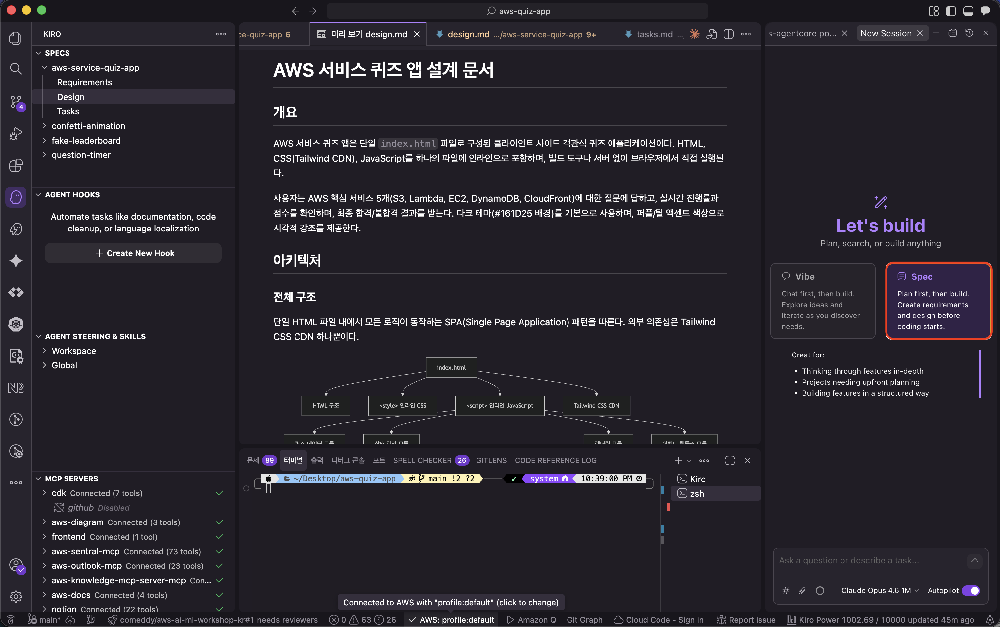

# Specs (스펙)

> 코드를 작성하기 전에 구조화된 계획을 수립하는 핵심 도구입니다.



## 스펙의 4단계

### 1단계: 프롬프트 (Prompt)

자연어로 원하는 기능을 설명합니다.

```
"제품에 대한 리뷰 시스템을 추가해주세요"
```

### 2단계: 요구사항 (Requirements)

EARS(Easy Approach to Requirements Syntax) 표기법의 인수 기준이 포함된 사용자 스토리를 생성합니다.

### 3단계: 설계 (Design)

데이터 플로우 다이어그램, 인터페이스, 스키마, API 엔드포인트 등의 기술 설계를 생성합니다.

### 4단계: 태스크 (Tasks)

진행 상황을 추적할 수 있는 개별 단계로 나누어진 실행 가능한 태스크 목록을 생성합니다.

## 핵심 특징

> **✅ 핵심**
**스펙은 살아있는 문서입니다.** 코드를 업데이트하면 스펙도 업데이트됩니다. 스펙을 업데이트하면 태스크가 재생성됩니다. 일회용 계획이 아닌, 코드베이스와 동기화되는 문서입니다. 자세한 내용은 [공식 문서](https://kiro.dev/docs/specs/)를 참고하세요.
