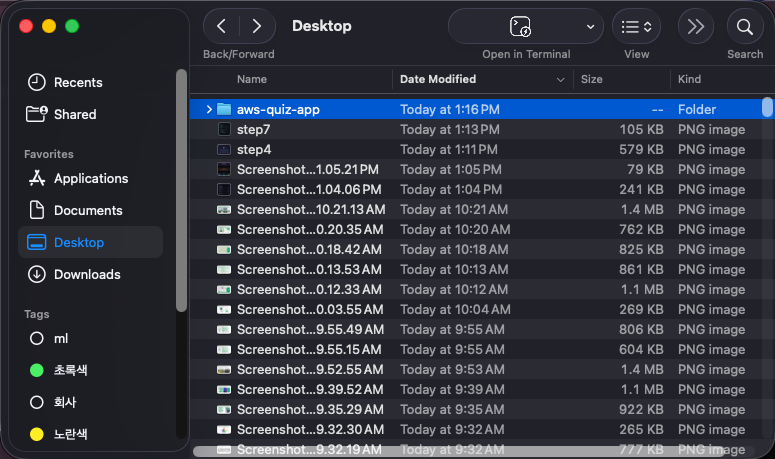

# Step 1: 다운로드, 설치 & 로그인

> Kiro를 설치하고 실행합니다.

## 진행 순서

### 1. Kiro 다운로드

[kiro.dev](https://kiro.dev)에서 OS에 맞는 설치 파일을 다운로드합니다.

### 2. 설치 & 실행

설치 파일을 실행한 후 Kiro를 엽니다.

### 3. 로그인

GitHub, Google, 또는 AWS Builder ID로 인증합니다.

### 4. 프로젝트 폴더 생성 & 열기

1. 데스크탑에 `aws-quiz-app` 폴더를 생성합니다
2. Kiro에서 **File → Open Folder**를 선택합니다
3. 생성한 폴더를 선택합니다

> **💡 참고**
**팁**: "Yes, I trust the authors" 프롬프트가 나타나면 클릭하세요. 폴더를 Kiro 창으로 드래그할 수도 있습니다.
