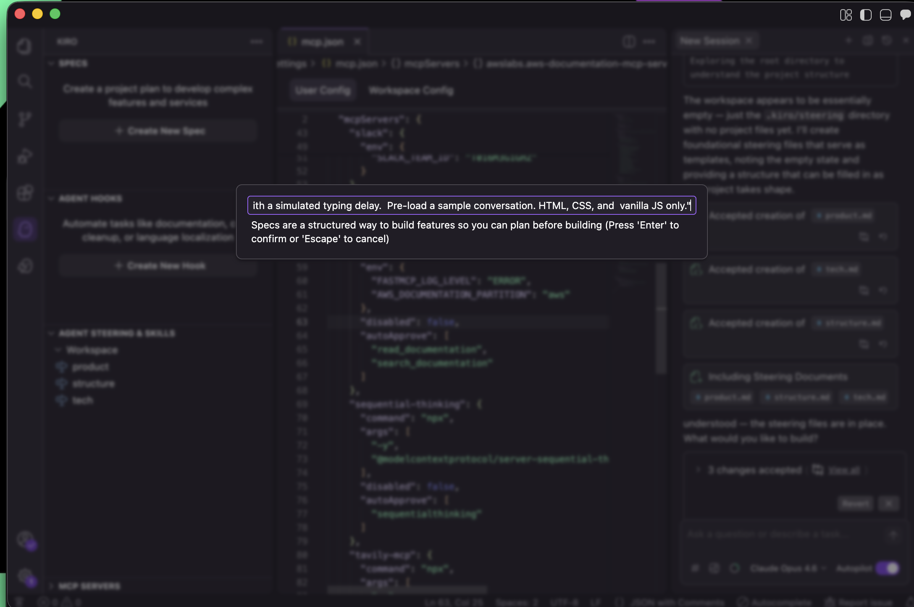
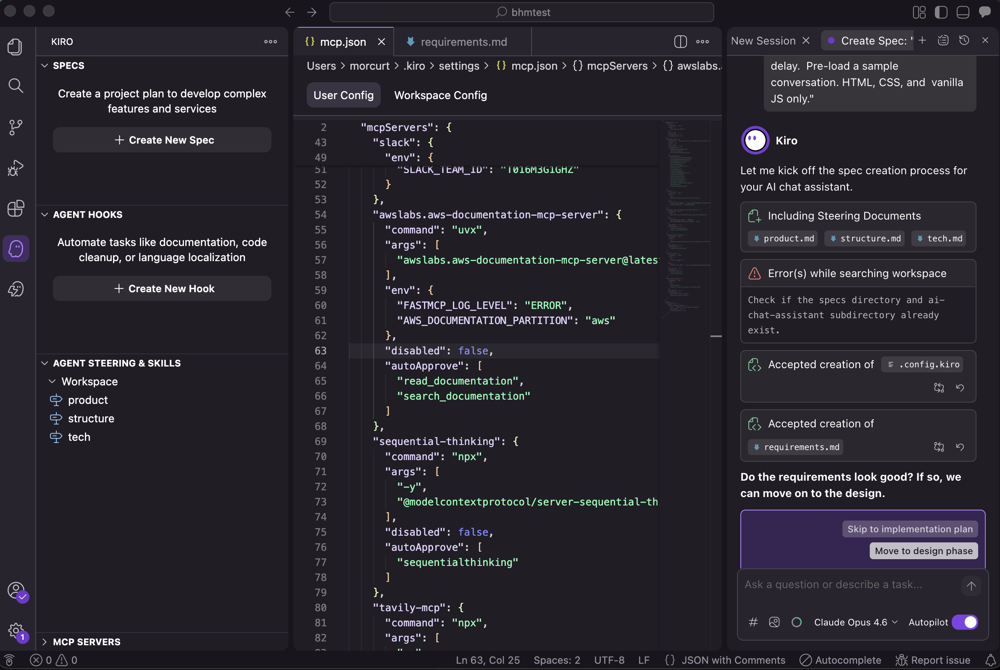

# Step 2: Spec 만들기

> Kiro에게 무엇을 만들고 싶은지 알려줍니다 — AI가 AI 인터페이스를 만듭니다.

## 진행 순서

### 1. New Spec 클릭

Kiro Panel의 **Specs** 섹션에서 **+** 버튼을 클릭합니다.



### 2. 프롬프트 입력

아래와 같은 프롬프트를 입력합니다:

```
Build an AWS services quiz app as a single index.html file.
Use Tailwind CSS loaded from the CDN (script tag, not npm).
All JavaScript must be inline in the HTML file — no npm,
no packages, no build step, no separate JS files.
5 multiple-choice questions about AWS services
(S3, Lambda, EC2, DynamoDB, CloudFront). Dark theme,
progress bar, score tracking, and a results screen
with pass/fail. Must work by just opening the HTML
file in a browser.
```

> **한국어 프롬프트도 가능합니다(다음복사입력):**
> "AWS 서비스 퀴즈 앱을 단일 index.html 파일로 만들어주세요. Tailwind CSS는 CDN 스크립트 태그로 로드하고, 모든 JavaScript는 HTML 파일 안에 인라인으로 작성해주세요. npm이나 빌드 과정 없이, S3, Lambda, EC2, DynamoDB, CloudFront에 대한 5개의 객관식 문제를 포함하세요. 다크 테마, 진행률 표시줄, 점수 추적, 합격/불합격 결과 화면을 구현해주세요."

### 3. 각 단계 검토

Kiro가 순서대로 생성합니다:

1. **Requirements** (요구사항) — 검토 후 "Move to design phase" 클릭
2. **Design** (설계) — 검토 후 다음 단계로 진행
3. **Task list** (태스크 목록) — 실행 가능한 작업 목록 생성



> **✅ 핵심**
각 단계를 검토하면서 필요한 수정사항을 요청할 수 있습니다. 스펙은 살아있는 문서이므로 언제든 업데이트할 수 있습니다.
