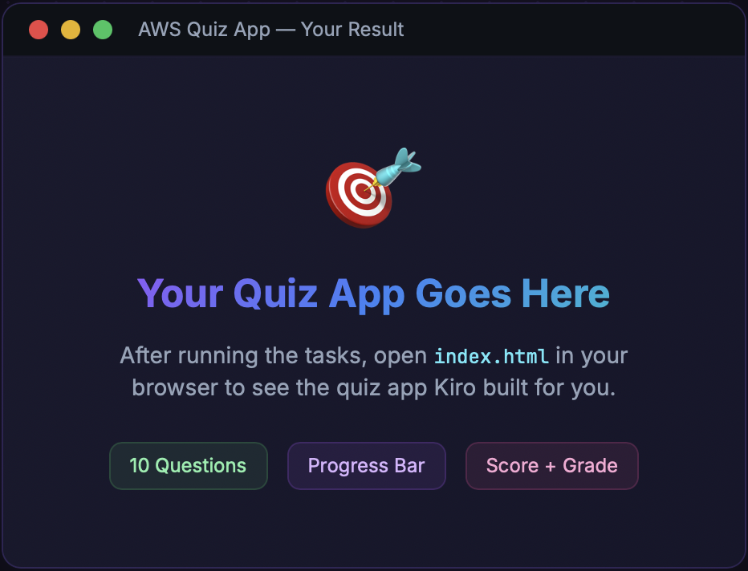

# Step 4: 퀴즈 앱 사용해보기

> 자연어로 퀴즈 앱을 반복 개선합니다.

## 진행 순서

### 1. Chat 패널 열기

사이드바의 채팅 아이콘을 클릭하거나 `⌘ + Shift + A`를 누릅니다.



### 2. 변경 요청하기

다음과 같은 프롬프트를 시도해보세요:

```
"타이머를 추가해주세요 — 문제당 30초"
```

```
"가짜 고득점자 리더보드를 보여주세요"
```

```
"80% 이상 득점하면 축하 애니메이션을 추가해주세요"
```

### 3. # 으로 파일 참조

채팅에서 `#`을 입력하면 특정 파일을 컨텍스트로 첨부할 수 있습니다.

### 4. 브라우저 콘솔로 디버깅

문제가 있어 보이면:

1. **개발자 도구**를 엽니다 (`⌘ + Option + I` Mac / `F12` Windows)
2. **Console** 탭을 클릭합니다
3. 빨간색 에러를 복사하여 Kiro 채팅에 붙여넣으면 자동으로 수정합니다

> **✅ 핵심**
**결과물**: 10개의 문제, 진행률 표시줄, 점수 및 등급이 포함된 퀴즈 앱이 완성됩니다.
