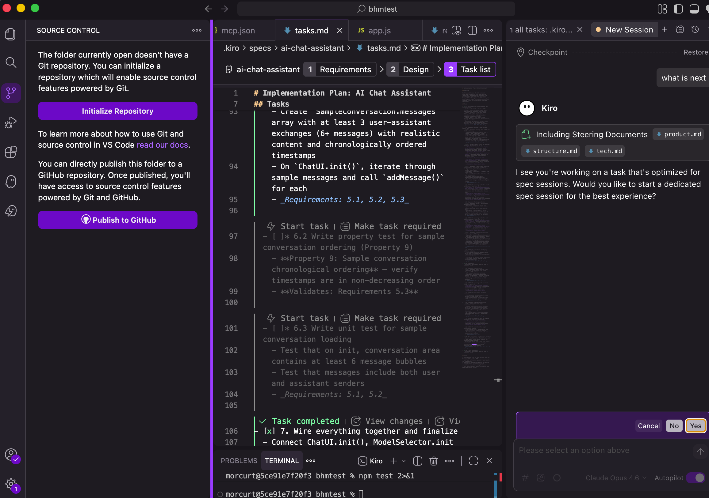
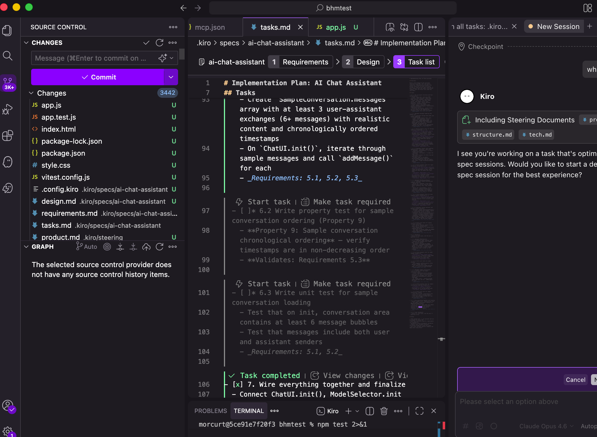
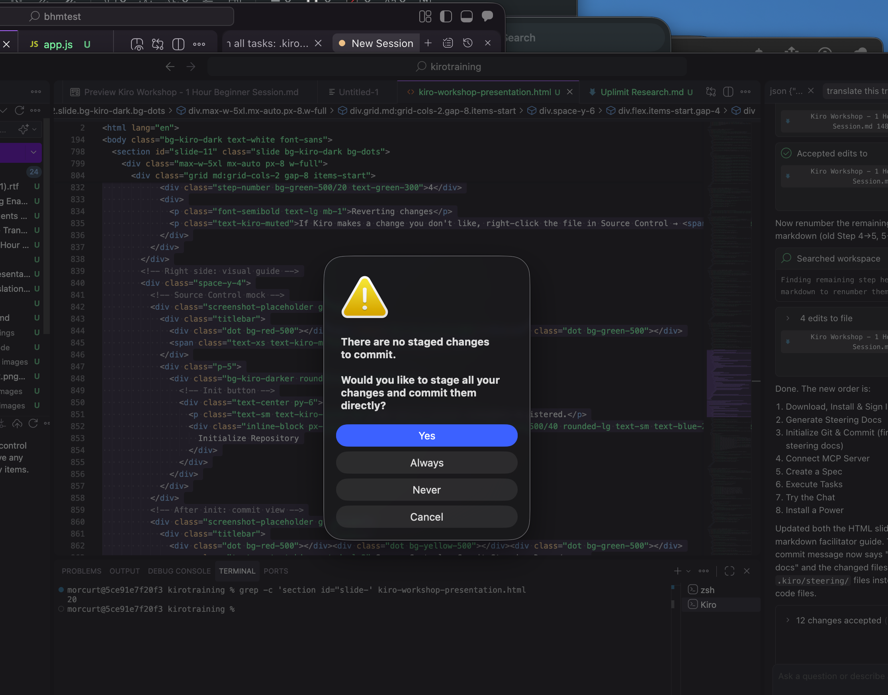

# Step 6: Git 초기화 & 커밋

> 프로젝트의 체크포인트를 저장합니다 — 코드 + 스티어링 문서를 포함합니다.

## Git을 사용하는 이유

Kiro가 코드를 작성할 때, Git으로 체크포인트를 저장할 수 있습니다. 문제가 생기면 한 번의 클릭으로 작동하던 버전으로 되돌릴 수 있습니다. 전체 프로젝트를 위한 "실행 취소" 기능이라고 생각하세요.

## 진행 순서

### 1. Source Control 열기

왼쪽 사이드바에서 브랜치 아이콘(3번째 아이콘)을 클릭합니다.

- 단축키: `⌃ + Shift + G` (Mac) / `Ctrl + Shift + G` (Windows)

### 2. "Initialize Repository" 클릭

파란색 버튼을 클릭합니다. 모든 변경 사항을 추적하는 `.git` 폴더가 생성됩니다.

### 3. 스티어링 문서 커밋

1. 커밋 메시지에 `add steering docs`를 입력합니다
2. **✓ 체크마크**를 클릭합니다

3. 변경 사항을 스테이지할지 묻는 프롬프트가 나타나면 "**Yes**"를 클릭합니다

### 4. 변경 사항 되돌리기

Kiro가 마음에 들지 않는 변경을 했다면:

- Source Control에서 파일을 우클릭 → "**Discard Changes**"를 선택하면 마지막 커밋으로 돌아갑니다

> **⚠️ 주의**
**Pro tip**: 각 주요 단계 후에 커밋하세요. AI가 생성한 코드로 작업할 때 안전망이 됩니다.
