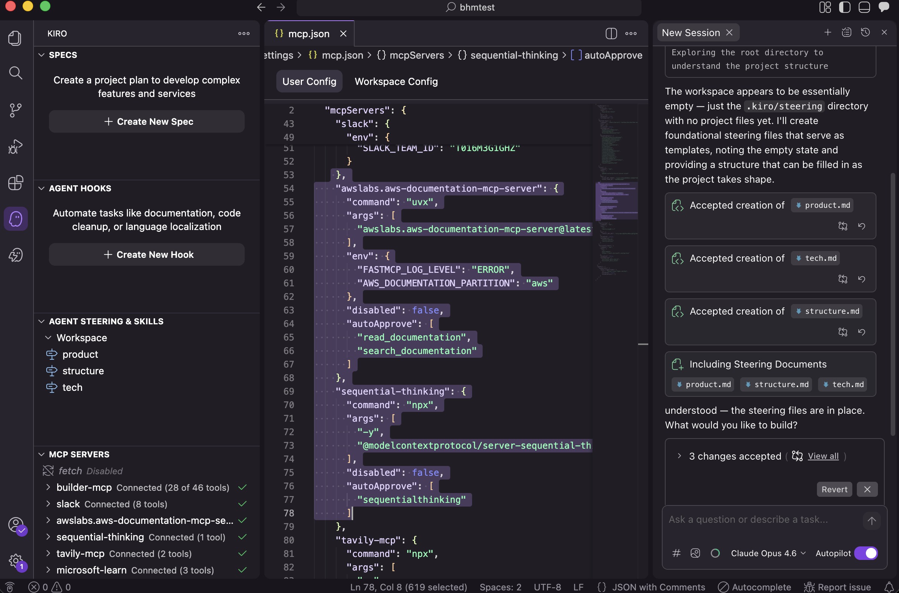

# Step 7: MCP 서버 연결하기

> Kiro에 AWS 문서 접근 권한을 부여합니다.

## 진행 순서

### 1. Command Palette 열기

- Mac: `⌘ + Shift + P`
- Windows: `Ctrl + Shift + P`

### 2. "MCP" 검색 및 선택

`MCP`를 입력하고 "**Kiro: Open MCP Configuration**"을 선택합니다.

### 3. JSON 설정 붙여넣기

파일 내용을 아래 JSON으로 교체합니다:

```json
{
  "mcpServers": {
    "aws-docs": {
      "command": "uvx",
      "args": [
        "awslabs.aws-documentation-mcp-server@latest"
      ],
      "env": {
        "FASTMCP_LOG_LEVEL": "ERROR"
      },
      "disabled": false,
      "autoApprove": [
        "read_documentation",
        "search_documentation"
      ]
    }
  }
}
```

### 4. 파일 저장

`⌘ + S`로 저장하면 Kiro가 자동으로 서버를 감지하고 연결합니다.



> **✅ 핵심**
이제 Kiro에게 AWS 관련 질문을 하면 실제 AWS 문서에 기반한 답변을 받을 수 있습니다.
